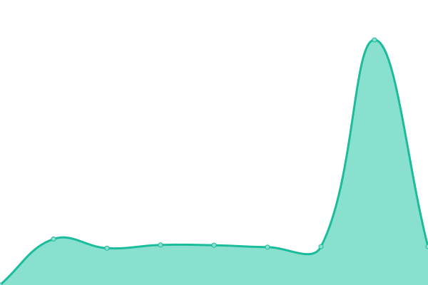
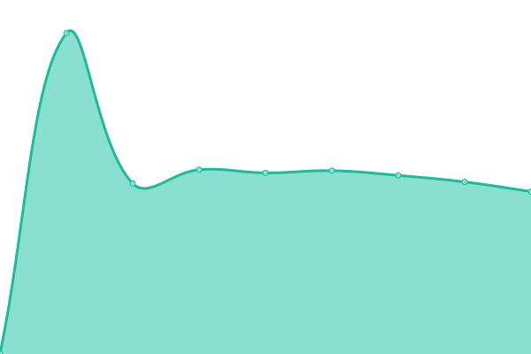

# [📈 Live Status](https://santobuonoivan.github.io/upptime): <!--live status--> **🟥 Complete outage**

This repository contains the open-source uptime monitor and status page for [santobuonoivan](https://santobuonoivan.github.io/upptime), powered by [Upptime](https://github.com/upptime/upptime).

With [Upptime](https://upptime.js.org), you can get your own unlimited and free uptime monitor and status page, powered entirely by a GitHub repository. We use [Issues](https://github.com/santobuonoivan/upptime/issues) as incident reports, [Actions](https://github.com/santobuonoivan/upptime/actions) as uptime monitors, and [Pages](https://santobuonoivan.github.io/upptime) for the status page.

<!--start: status pages-->
<!-- This summary is generated by Upptime (https://github.com/upptime/upptime) -->
<!-- Do not edit this manually, your changes will be overwritten -->
<!-- prettier-ignore -->
| URL | Status | History | Response Time | Uptime |
| --- | ------ | ------- | ------------- | ------ |
|  [Wineture Core](https://api.wineture.cl/api) | 🟥 Down | [wineture-core.yml](https://github.com/santobuonoivan/upptime/commits/HEAD/history/wineture-core.yml) | 

 593ms
     
 | 

<a href="https://santobuonoivan.github.io/upptime/history/wineture-core">99.97%</a>
    

|  [Wineture Ui](https://wineture.cl) | 🟥 Down | [wineture-ui.yml](https://github.com/santobuonoivan/upptime/commits/HEAD/history/wineture-ui.yml) | 

 1015ms
     
 | 

<a href="https://santobuonoivan.github.io/upptime/history/wineture-ui">99.98%</a>
    

|  [Wineture Duck Payments](https://pay.wineture.cl/api) | 🟥 Down | [wineture-duck-payments.yml](https://github.com/santobuonoivan/upptime/commits/HEAD/history/wineture-duck-payments.yml) | 

 606ms
     
 | 

<a href="https://santobuonoivan.github.io/upptime/history/wineture-duck-payments">99.98%</a>
    

|  [Wineture Content Strapi](https://content.wineture.cl) | 🟥 Down | [wineture-content-strapi.yml](https://github.com/santobuonoivan/upptime/commits/HEAD/history/wineture-content-strapi.yml) | 

 605ms
     
 | 

<a href="https://santobuonoivan.github.io/upptime/history/wineture-content-strapi">99.99%</a>
    

|  [Wineture pages Strapi](https://pages.wineture.cl) | 🟥 Down | [wineture-pages-strapi.yml](https://github.com/santobuonoivan/upptime/commits/HEAD/history/wineture-pages-strapi.yml) | 

 830ms
     
 | 

<a href="https://santobuonoivan.github.io/upptime/history/wineture-pages-strapi">99.99%</a>
    

|  [wineture Auth keycloack](https://auth.wineture.cl) | 🟥 Down | [wineture-auth-keycloack.yml](https://github.com/santobuonoivan/upptime/commits/HEAD/history/wineture-auth-keycloack.yml) | 

 912ms
     
 | 

<a href="https://santobuonoivan.github.io/upptime/history/wineture-auth-keycloack">100.00%</a>
    

<!--end: status pages-->

[**Visit our status website →**](https://santobuonoivan.github.io/upptime)

## 📄 License

- Powered by: [Upptime](https://github.com/upptime/upptime)
- Code: [MIT](./LICENSE) © [Anand Chowdhary](https://anandchowdhary.com), supported by [Pabio](https://pabio.com)
- Data in the `./history` directory: [Open Database License](https://opendatacommons.org/licenses/odbl/1-0/)
